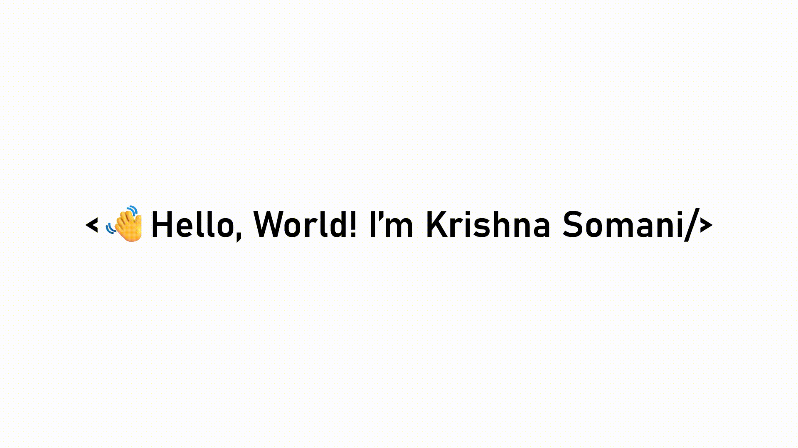

 
  

  <h3 align="center">Visitor Counter </h3>

 
  

# 🙋‍♂️ About Me:

  

- 🔭 I’m a CSE student at SRM University
  
- 🤖 I'm intersted in AI/ML and Data Science

- 🌱 Portfolio website - **https://kr1shnasomani.vercel.app/**
  
- 📫 How to reach me - **krishnasomani272005@gmail.com**
  
- 🤝 Connect with me - **https://www.linkedin.com/in/kr1shnasomani/**

 

# 🛠️ My Skill Set:

  
  
  
  
  
  
  
  
  
  
  
  
  
  
  
  
  
  
  
  
  
  
  
  

# 📂 Open Source Projects:

|  #  | Project                                                                 | Language                                                                                                  | Tool/Library                                                                                                                                                                                                                                                             |
|-----|-------------------------------------------------------------------------|-----------------------------------------------------------------------------------------------------------|--------------------------------------------------------------------------------------------------------------------------------------------------------------------------------------------------------------------------------------------------------------------------|
| 1.  | [Sportiq](https://github.com/kr1shnasomani/Sportiq)                     |                         |                                                                                                   |
| 2.  | [TreeTracer](https://github.com/kr1shnasomani/TreeTracer)               |                         |                                                                                                   |
| 3.  | [BloodPrint](https://github.com/kr1shnasomani/BloodPrint)               |  |        |
| 4.  | [ML](https://github.com/kr1shnasomani/ML)                               |    |          |
| 5.  | [lexora](https://github.com/kr1shnasomani/lexora)                       |    |                |
| 6.  | [gigHood](https://github.com/Vishnugupta2711/gigHood)                   |    |                |
| 7.  | [Aegis](https://github.com/kr1shnasomani/Aegis)                         |    |           |
| 8.  | [argus](https://github.com/kr1shnasomani/argus)                         |    |             |
| 9.  | [Mailgenaix](https://github.com/kr1shnasomani/Mailgenaix)               |  |                                                                                       |
| 10. | [Portfolio Website](https://github.com/kr1shnasomani/Portfolio-Website) |             |              |
| 11. | [SRM-Academia-Toolkit](https://github.com/kr1shnasomani/SRM-Academia-Toolkit) |  |   |
| 12. | [claude-token-counter](https://github.com/kr1shnasomani/claude-token-counter) |  |   |

# 📈 GitHub Stats:
<h3>

  

  

